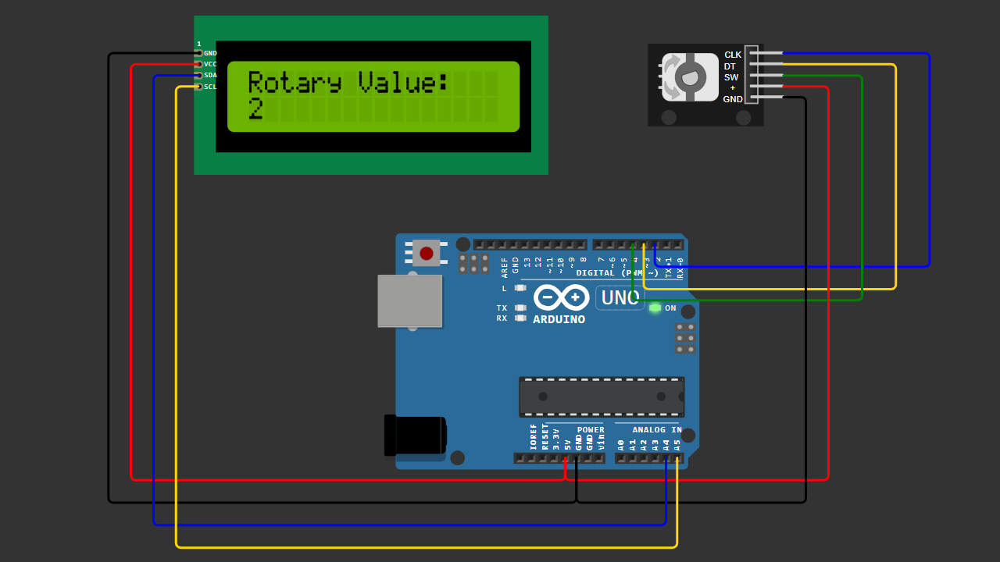

# Arduino Rotary Encoder + LCD I2C Display

This project demonstrates how to use a rotary encoder to control a counter value and display it on a 16x2 LCD with I2C module.

Rotate clockwise to increase the value.  
Rotate counter-clockwise to decrease the value.  
Press the button to reset the value to zero.

---

## 🎥 YouTube Tutorial
Watch the full tutorial here:

---

## 🧩 Components Used

- Arduino Uno
- Rotary Encoder (CLK, DT, SW)
- 16x2 LCD with I2C module (PCF8574)
- Breadboard
- Jumper wires

---

## 🔌 Wiring

### Rotary Encoder
| Rotary Pin | Arduino Pin |
|------------|------------|
| CLK        | D2         |
| DT         | D3         |
| SW         | D4         |
| VCC        | 5V         |
| GND        | GND        |

### LCD I2C
| LCD Pin | Arduino Pin |
|---------|------------|
| VCC     | 5V         |
| GND     | GND        |
| SDA     | A4         |
| SCL     | A5         |

---

## 📷 Wiring Diagram

> Make sure your wiring matches the diagram above before uploading the code.

---

## 💻 Arduino Code

You can download the Arduino sketch here:

[Download Arduino Code](Arduino_Rotary___LCD_I2C_Display.ino)

Or open the `.ino` file directly inside this repository.

---

## 📦 Library Required

This project requires:

LiquidCrystal_I2C Library (version 1.1.2 recommended)

You can install it using one of the methods below:

---

### ✅ Method 1 — Install via Library Manager (Recommended)

1. Open Arduino IDE  
2. Go to **Sketch → Include Library → Manage Libraries**  
3. Search for: `LiquidCrystal I2C`  
4. Install the library  

---

### ✅ Method 2 — Manual Installation (Included in This Repository)

If you prefer manual installation:

1. Download this repository
2. Locate the file:
   `LiquidCrystal_I2C-1.1.2.zip`
3. Open Arduino IDE
4. Go to **Sketch → Include Library → Add .ZIP Library**
5. Select `LiquidCrystal_I2C-1.1.2.zip`
6. Click Open

Done ✅

---

## 📌 Features

- Real-time value update
- Clockwise & Counter-clockwise detection
- Button reset function
- Clean wiring using I2C (only 4 wires for LCD)

---

If this project helps you, don't forget to ⭐ star the repository!
